# Improve Warehouse Productivity using Order Batching with Python 📦

[](LICENSE)
[](https://www.python.org/downloads/)
[](https://github.com/astral-sh/uv)
[](https://streamlit.io)
[](Dockerfile)

In a **Distribution Centre (DC)**, walking time between locations during the picking route can account for 60%-70% of an operator’s working time. Reducing this walking time is the most effective way to increase your DC overall productivity.

<p align="center">
  <a href="https://www.samirsaci.com/improve-warehouse-productivity-using-order-batching-with-python/" target="_blank" rel="noopener noreferrer">
    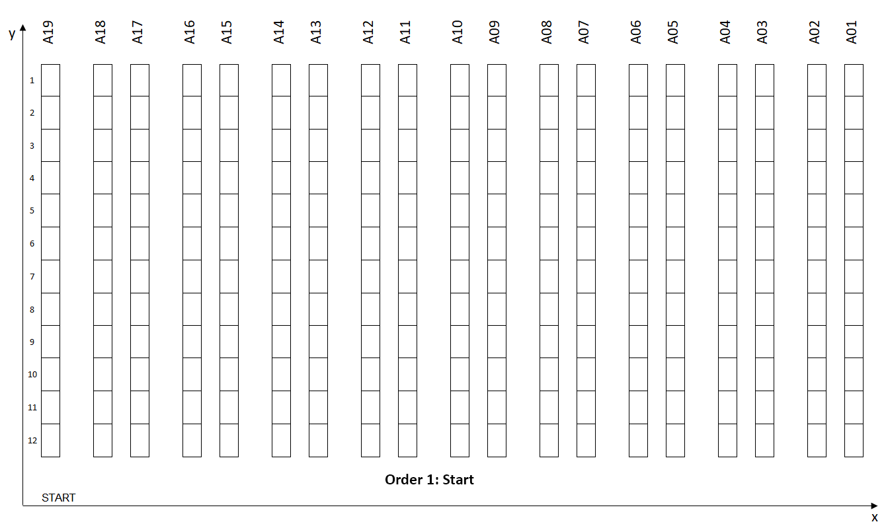
  </a>
</p>
<p align="center"><b>Scenario 1:</b> Picking routes with 1 order picked per wave</p>


I have published a series of articles proposing an approach to design a model that simulates the impact of multiple picking processes and routing methods to identify optimal order picking using the Single Picker Routing Problem (SPRP) for a two-dimensional warehouse model (axis-x, axis-y).

SPRP is a specific application of the general **Travelling Salesman Problem (TSP)** answering the question:

>  “Given a list of storage locations and the distances between each pair of locations, what is the shortest possible route that visits each storage location and returns to the depot ?”

This repo contains a ready-to-use **Streamlit App** designed for **Logistics Engineers** to test these different strategies with their own dataset of order line records _(see the expected data format in [Load the data](#load-the-data))_.

## ⚡ Quick Start

**With [uv](https://docs.astral.sh/uv/) (manages Python and dependencies automatically):**
```bash
uv run streamlit run app.py
```

**With Docker:**
```bash
docker compose up --build
```

Then open [http://localhost:8501](http://localhost:8501) — details in the **Build the application locally** section below.

### Understand the theory behind 📜
- Improve Warehouse Productivity using Order Batching with Python - [Article](https://www.samirsaci.com/improve-warehouse-productivity-using-order-batching-with-python/)
- Improve Warehouse Productivity using Spatial Clustering with Python Scipy - [Article](https://www.samirsaci.com/improve-warehouse-productivity-using-spatial-clustering-with-python/)
- Design Pathfinding Algorithm using Google AI to Improve Warehouse Productivity - [Article](https://www.samirsaci.com/improve-warehouse-productivity-using-pathfinding-algorithm-with-python/)


# Picking Route Optimisation 🚶‍♂️ 

## 💾 **Initial: prepare order lines datasets with picking locations**

Based on your **actual warehouse layout**, storage locations are mapped with **2-D (x, y) coordinates** that will be used to measure walking distance.

<p align="center">
  <a href="https://www.samirsaci.com/improve-warehouse-productivity-using-order-batching-with-python/" target="_blank" rel="noopener noreferrer">
    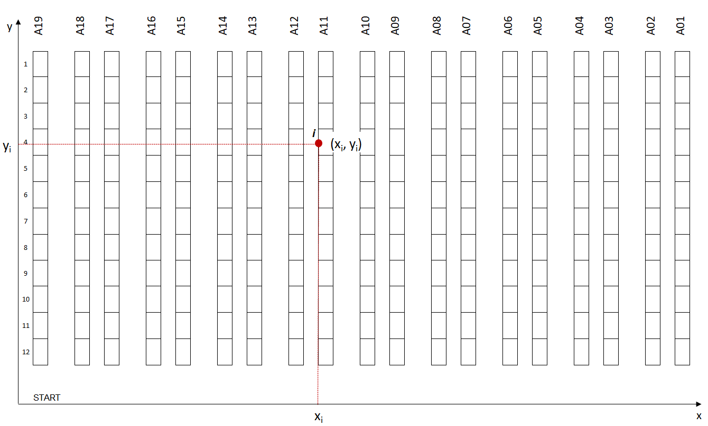
  </a>
</p>
<p align="center">Warehouse Layout with 2D Coordinates</p>

Every storage location must be linked to a Reference using Master Data. (For instance, reference #123129 is located in coordinate (xi, yi)). You can then associate every order line to a geographical location for picking.

<p align="center">
  <a href="https://www.samirsaci.com/improve-warehouse-productivity-using-order-batching-with-python/" target="_blank" rel="noopener noreferrer">
    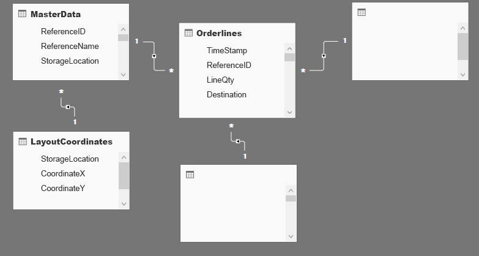
  </a>
</p>
<p align="center">Database Schema</p>

Order lines can be extracted from your WMS Database. This table should be joined with the Master Data table to link each order line to a storage location and specify its (x, y) coordinates in your warehouse. Extra tables can be added to include more parameters in your model, like (Destination, Delivery lead time, Special Packing, ..).

## 🧪 **Experiment 1: Impacts of wave picking on the pickers' walking distance?**
_For more information and details about calculation: [Article](https://www.samirsaci.com/improve-warehouse-productivity-using-order-batching-with-python/)_

### ✔️ Problem Statement

For this study, we will use an E-Commerce-type DC where items are stored on 4-level shelves. These shelves are organized in multiple rows (Row#: 1 … n) and aisles (Aisle#: A1 … A_n).

<p align="center">
  <a href="https://www.samirsaci.com/improve-warehouse-productivity-using-order-batching-with-python/" target="_blank" rel="noopener noreferrer">
    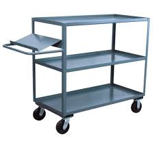
  </a>
</p>
<p align="center">Different routes between two storage locations in the warehouse</p>

1. Item Dimensions: Small and light dimensions of items
2. Picking Cart: lightweight picking cart with a capacity of 10 orders
3. Picking Route: Picking Route starts and ends at the exact location

Scenario 1, the worst in terms of productivity, can be easily optimised because of
- Locations: Orders #1 and #2 have common picking locations
- Zones: orders have picking locations in a common zone
- Single-line Orders: items_picked/walking_distance efficiency is very low

<p align="center">
  <a href="https://www.samirsaci.com/improve-warehouse-productivity-using-order-batching-with-python/" target="_blank" rel="noopener noreferrer">
    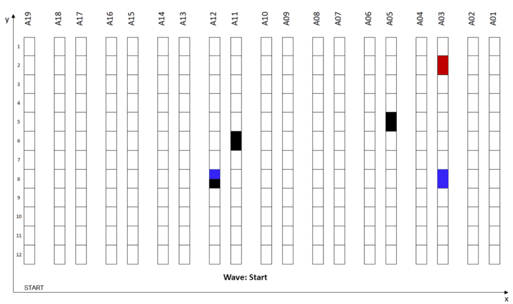
  </a>
</p>
<p align="center"><b>Scenario 2:</b> Wave Picking applied to Scenario 1</p>

The first intuitive way to optimise this process is to combine these three orders into a single picking route — a strategy commonly called Wave Picking.

We will build a model to simulate the impact of several wave-picking strategies on the total walking distance for a specific set of orders.


### 📊 Simulation 
In the article, I have built a set of functions needed to run different scenarios and simulate the picker's walking distance.

**Function:** Calculate the distance between two picking locations
<p align="center">
  <a href="https://www.samirsaci.com/improve-warehouse-productivity-using-order-batching-with-python/" target="_blank" rel="noopener noreferrer">
    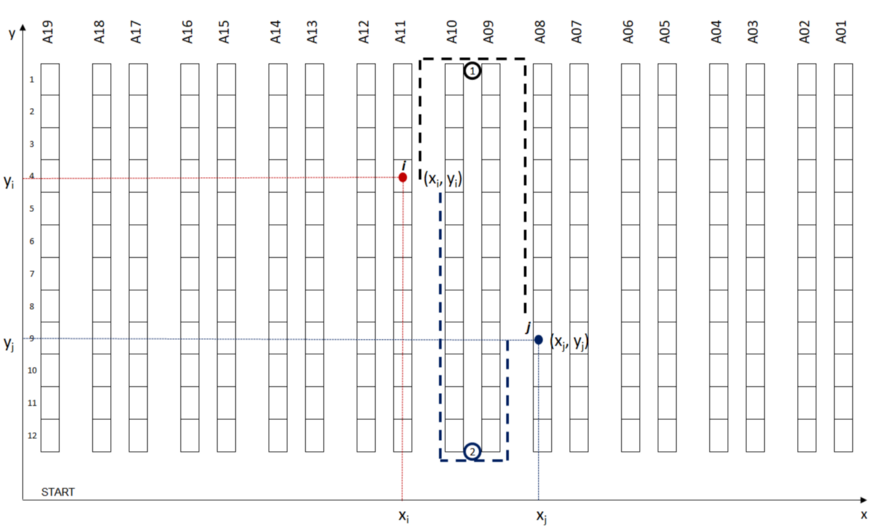
  </a>
</p>
<p align="center"><b>Function:</b> Different routes between two storage locations in the warehouse</p>

This function calculates the walking distance between points i (xi, yi) and j (xj, yj).

Objective: return the shortest walking distance between the two potential routes from point i to point j.
> Parameters
- y_low: lowest point of your alley (y-axis)
- y_high: highest point of your alley (y-axis)

**Function:** The Next Closest Location
<p align="center">
  <a href="https://www.samirsaci.com/improve-warehouse-productivity-using-order-batching-with-python/" target="_blank" rel="noopener noreferrer">
    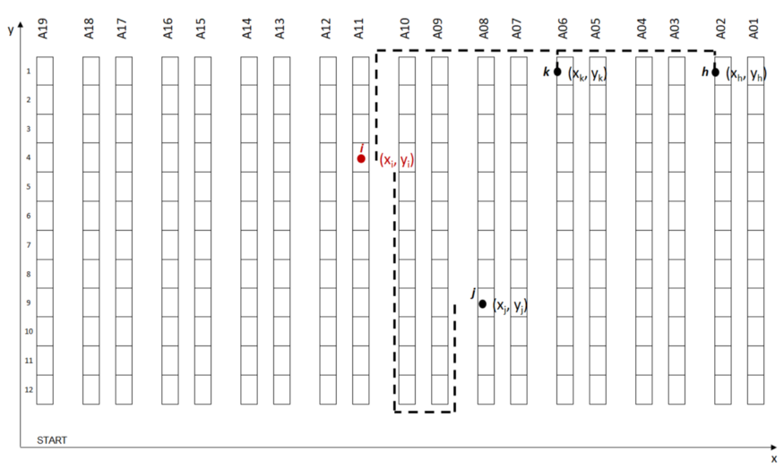
  </a>
</p>
<p align="center"><b>Function:</b> Next Storage Location Scenario</p>

This function will choose the next location among several candidates to continue your picking route.

Objective: return the closest location as the best candidate

This function will create your picking route from a set of orders to prepare.
- Input: a list of (x, y) locations based on items to be picked for this route
- Output: an ordered sequence of locations covered and total walking distance

**Function:** Create batches of n orders to be picked at the same time
- Input: order lines data frame (df_orderlines), number of orders per wave (orders_number)
- Output: data frame mapped with wave number (Column: WaveID), the total number of waves (waves_number)

**Function:** listing picking locations of wave_ID picking route
- Input: order lines data frame (df_orderlines) and wave number (waveID)
- Output: list of locations i(xi, yi) included in your picking route

### ☑️ **Results and Next Steps**

After setting up all necessary functions to measure picking distance, we can now test our picking route strategy with picking order lines.

Here, we first decided to start with a very simple approach
- Orders Waves: orders are grouped by chronological order of receiving time from OMS ( TimeStamp)
- Picking Route: The picking route strategy follows the Next Closest Location logic

To estimate the impact of wave picking strategy on your productivity, we will run several simulations with a gradual number of orders per wave:
1. Measure Total Walking Distance: how much walking distance is reduced when the number of orders per route is increased?
2. Record Picking Route per Wave: recording the sequence of locations per route for further analysis

<p align="center">
  <a href="https://www.samirsaci.com/improve-warehouse-productivity-using-order-batching-with-python/" target="_blank" rel="noopener noreferrer">
    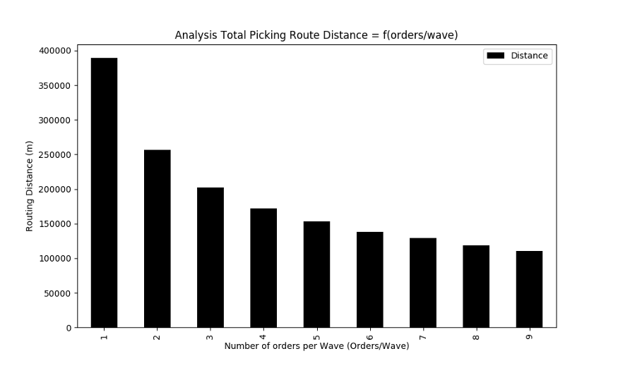
  </a>
</p>
<p align="center"><b>Experiment 1:</b> Results for 5,000 order lines with a ratio from 1 to 9 orders per route</p>

## 🧮**Experiment 2: Impacts of orders batching using spatial clusters of picking locations?**
_For more information and details about calculation: [Article](https://www.samirsaci.com/improve-warehouse-productivity-using-spatial-clustering-with-python/)_

<p align="center">
  <a href="https://www.samirsaci.com/improve-warehouse-productivity-using-order-batching-with-python/" target="_blank" rel="noopener noreferrer">
    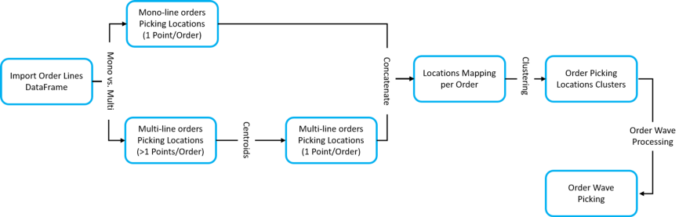
  </a>
</p>
<p align="center"><b>Order Lines Processing</b> for Order Wave Picking using Clustering by Picking Location</p>

### 💡**Idea: Picking Locations Clusters** ###

Group picking locations by clusters to reduce the walking distance for each picking route. _(Example: the maximum walking distance between two locations is <15 m)_

Spatial clustering is the task of grouping together a set of points in a way that objects in the same cluster are more similar to each other than to objects in other clusters.

For this part we will split the orders in two categories:
- Mono-line orders: they can be associated to a unique picking locations 
- Multi-line orders: that are associated with several picking locations

#### **Mono-line orders** 
<p align="center">
  <a href="https://www.samirsaci.com/improve-warehouse-productivity-using-order-batching-with-python/" target="_blank" rel="noopener noreferrer">
    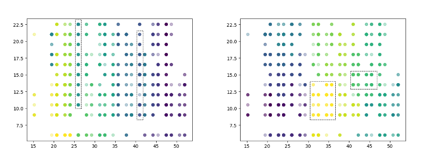
  </a>
</p>
<p align="center">Left [Clustering using Walking Distance] / Right [Clustering using Euclidian Distance]</p>

_Grouping orders in cluster within n meters of walking distance_

#### **Multi-line orders** 
<p align="center">
  <a href="https://www.samirsaci.com/improve-warehouse-productivity-using-order-batching-with-python/" target="_blank" rel="noopener noreferrer">
    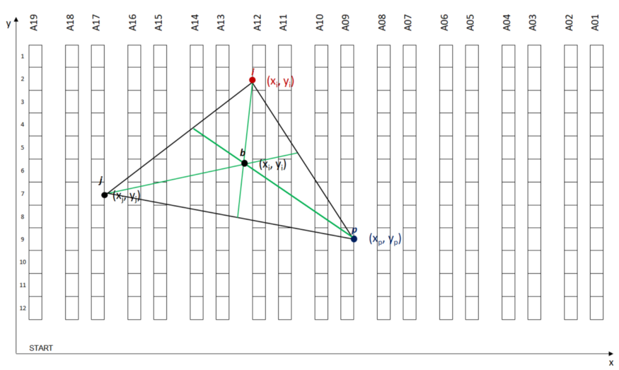
  </a>
</p>
<p align="center"><b>Example: </b>Centroid of three Picking Locations</p>

_Grouping multi-line orders in cluster (using centroids of picking locations) within n meters of walking distance_


### 🐁 **Model Simulation** ###

#### **Methodology** 

To sum up, our model construction, see the chart below, we have several steps before Picking Routes Creation using Wave Processing.

At each step, we have a collection of parameters that can be tuned to improve performance:
<p align="center">
  <a href="https://www.samirsaci.com/improve-warehouse-productivity-using-order-batching-with-python/" target="_blank" rel="noopener noreferrer">
    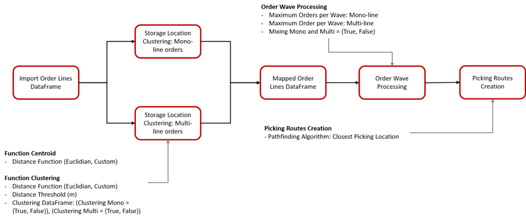
  </a>
</p>
<p align="center"><b>Methodology: </b>Model Construction with Parameters</p>

#### **Comparing three methods of wave creation**
<p align="center">
  <a href="https://www.samirsaci.com/improve-warehouse-productivity-using-order-batching-with-python/" target="_blank" rel="noopener noreferrer">
    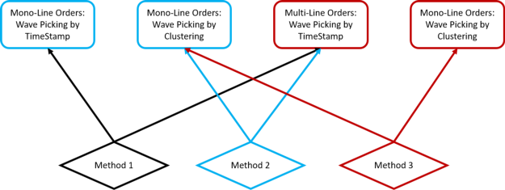
  </a>
</p>
<p align="center"><b>Methodology: </b>Three Methods for Wave Processing</p>

We’ll start first by assessing the impact of Order Wave processing by clusters of picking locations on total walking distance.

We’ll be testing three different methods:
- Method 1: we do not apply clustering (i.e Initial Scenario)
- Method 2: we apply clustering on single-line orders only
- Method 3: we apply clustering to single-line orders and centroids of multiline orders

#### **Parameters of Simulation**
- Order lines: 20,000 Lines
- Distance Threshold: Maximum distance between two picking locations _(distance_threshold = 35 m)_
- Orders per Wave: orders_number in [1, 9]

#### **Final Results**
<p align="center">
  <a href="https://www.samirsaci.com/improve-warehouse-productivity-using-order-batching-with-python/" target="_blank" rel="noopener noreferrer">
    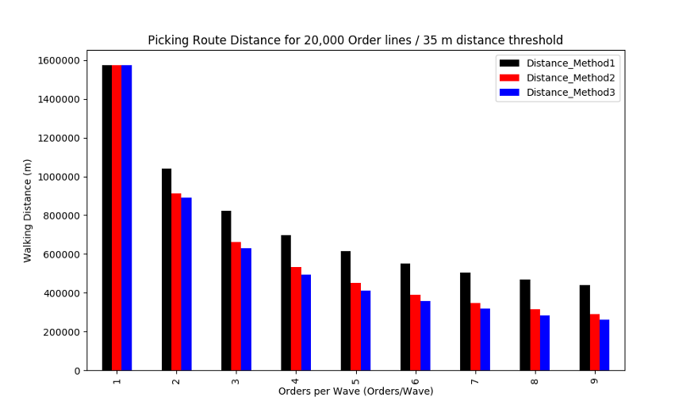
  </a>
</p>
<p align="center"><b>Test 1:</b> 20,000 Order Lines / 35 m distance Threshold</p>

- Best Performance: Method 3 for 9 orders/Wave with 83% reduction of walking distance
- Method 2 vs. Method 1: Clustering for mono-line orders reduce the walking distance by 34%
- Method 3 vs. Method 2: Clustering for mono-line orders reduce the walking distance by 10%

# Project structure 📁

```
picking-route/
├── app.py                  # Streamlit application (UI + simulation orchestration)
├── utils/
│   ├── routing/            # Distance calculation & picking-route creation (SPRP heuristic)
│   ├── batch/              # Experiment 1: order batching by wave
│   ├── cluster/            # Experiment 2: spatial clustering of picking locations
│   ├── process/            # Order lines pre-processing (mono/multi-line split)
│   └── results/            # Plotly charts rendered in the app
├── static/
│   ├── in/df_lines.csv     # Sample dataset (5,000 order lines)
│   ├── img/                # README illustrations
│   └── out/                # Generated charts (created at runtime, gitignored)
├── pyproject.toml          # Project metadata & dependencies (managed with uv)
├── uv.lock                 # Locked dependency versions for reproducible installs
├── Dockerfile              # Multi-stage container build (uv + python-slim)
└── docker-compose.yml      # One-command containerised run
```

# Build the application locally 🏗️ 

Because the resources provided by Streamlit Cloud or Heroku are limited, I suggest running this application locally.

The project is managed with [uv](https://docs.astral.sh/uv/) — dependencies are declared in `pyproject.toml` and locked in `uv.lock` for reproducible installs.

## **Option 1: Run with uv (recommended)** 

### Install uv (if you don't have it yet)
```
    curl -LsSf https://astral.sh/uv/install.sh | sh
```

### Run the application
```
    uv run streamlit run app.py --server.address 0.0.0.0
```

That's it — `uv run` automatically creates the virtual environment, installs the locked dependencies and starts the app.

## **Option 2: Run with Docker 🐳**

### Build and start with Docker Compose
```
    docker compose up --build
```

Or with plain Docker:
```
    docker build -t picking-route .
    docker run -p 8501:8501 picking-route
```

Then open [http://localhost:8501](http://localhost:8501) in your browser.

### Open the app in your browser
When running with uv, Streamlit prints the local URL in your terminal — click it (or open [http://localhost:8501](http://localhost:8501)).
<p align="center">
  <a href="https://www.samirsaci.com/improve-warehouse-productivity-using-order-batching-with-python/" target="_blank" rel="noopener noreferrer">
    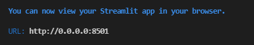
  </a>
</p>
<p align="center"><b>Instructions:</b> Click on the URL</p>
  
> -> Enjoy!

# Use the application 🖥️ 
> This app has not been deployed; you need to use it locally.

## **Why should you use it?**
This Streamlit Web Application has been designed for Supply Chain Engineers to help them simulate the impact on picking route optimization on the total distance of their picking operators.

## **Load the data**

- You can use the dataset located in the folder 
 `static/in/df_lines.csv`
- You can build your own dataset following the steps of ('Initial Step') above

### Expected data format

The app reads a CSV file with one row per **order line**, with the following columns:

| Column | Type | Description | Example |
|--------|------|-------------|---------|
| `DATE` | date | Order receiving date/time from the OMS | `12/11/2018` |
| `OrderNumber` | int | Order identifier (lines sharing it belong to the same order) | `3780678` |
| `SKU` | int/str | Item reference to pick | `399573` |
| `PCS` | int | Number of pieces to pick | `1` |
| `ReferenceID` | int/str | Master data reference | `399573` |
| `Location` | str | Storage location code | `A1119504` |
| `Alley_Number` | str | Alley identifier | `A11` |
| `Cellule` | int | Cell number within the alley | `19` |
| `Coord` | str | 2-D picking coordinates as `"[x, y]"` (metres) | `"[19.5, 21.0]"` |
| `AlleyCell` | str | Concatenation of alley + cell | `A1119` |

The columns actually used by the simulations are `DATE`, `OrderNumber`, `SKU`, `PCS` and `Coord` — the others are kept for traceability with the warehouse layout. To use your own data, replace `static/in/df_lines.csv` with a file following the same schema.

## 🔬 Experiment 1
<p align="center">
  <a href="https://www.samirsaci.com/improve-warehouse-productivity-using-order-batching-with-python/" target="_blank" rel="noopener noreferrer">
    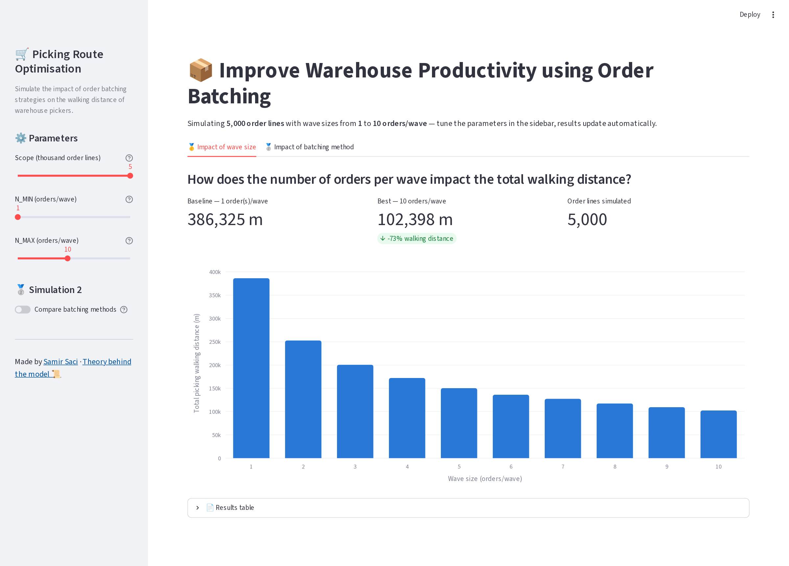
  </a>
</p>
<p align="center"><b>Experiment 1:</b> Simulation 1 runs on arrival — parameters in the sidebar, KPIs and chart update automatically</p>

### **Step 1:** Scope _(sidebar)_

As the computation time can increase exponentially with the size of the dataset _(optimisation can be done)_ you can ask the model to take only the first n thousand lines for analysis.

### **Step 2:** Fix the range of orders/wave to simulate _(sidebar)_

Use the **N_MIN / N_MAX** sliders to set the range of orders per wave to test (default: 1 to 10).

### **Step 3:** Results appear automatically

Simulation 1 runs automatically when you open the app and re-runs whenever you change a parameter — results are cached, so revisiting a previous setting is instant.

### **Final Results**

The bar chart in the screenshot above shows the total walking distance per wave size — 💡 this is the same graph as the one presented in the article.

## 🧪 Experiment 2
<p align="center">
  <a href="https://www.samirsaci.com/improve-warehouse-productivity-using-spatial-clustering-with-python/" target="_blank" rel="noopener noreferrer">
    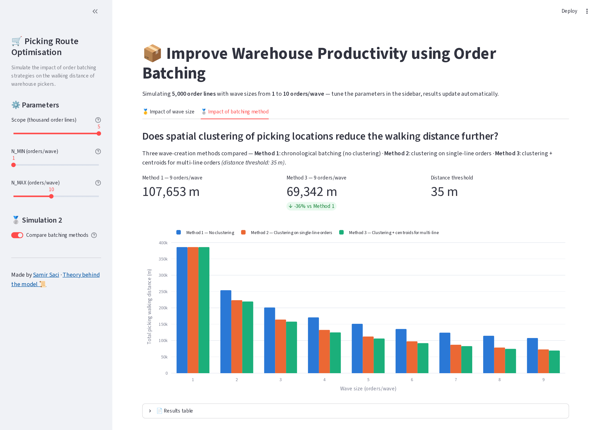
  </a>
</p>
<p align="center"><b>Experiment 2:</b> The three batching methods compared — enabled with the sidebar toggle</p>

### **Step 1:** Scope _(sidebar)_

Simulation 2 uses the same scope and wave-size range as Simulation 1.

### **Step 2:** Turn on **Compare batching methods** _(sidebar)_

Open the **🥈 Impact of batching method** tab and enable the toggle — this simulation runs the three methods, so it takes roughly 3× longer than Simulation 1.

### **Final Results**

The grouped bar chart in the screenshot above compares the three methods per wave size — 💡 this is the same graph as the one presented in the article.

## Development 🛠️

Dev tooling is declared in the `dev` dependency group of `pyproject.toml`:

```bash
uv sync                  # install runtime + dev dependencies in .venv
uv run ruff check .      # lint
uv run pytest            # run tests (test suite in progress)
```

Useful dependency commands: `uv add <pkg>` / `uv remove <pkg>` (both update `uv.lock` automatically), `uv lock --upgrade` to refresh pinned versions.

## Contributing 🤝

Contributions are welcome! Feel free to:
- Open an [issue](https://github.com/samirsaci/picking-route/issues) for bugs, questions or feature ideas
- Submit a pull request — please describe the motivation and keep changes focused

## License 📝

This project is licensed under the [MIT License](LICENSE) — free to use, modify and distribute.

## About me 🤓
Senior Supply Chain and Data Science consultant with international experience working on Logistics and Transportation operations.\
For **consulting or advising** on analytics and sustainable supply chain transformation, feel free to contact me via [Logigreen Consulting](https://www.logi-green.com/)\
Please have a look at my personal blog: [Personal Website](https://samirsaci.com)
